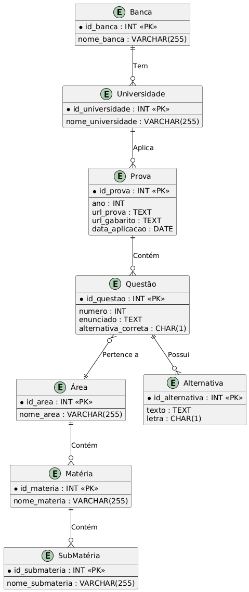

# Econrio Scraping
Extraindo e organizando questões dos vestibulares do Econrio. 

## Diagrama de relacionamento
Feito com o [PlantUML](https://www.plantuml.com/plantuml/uml/VLJ1Jkim4BpdAooVtaFA0QHUK5Krb4eW12eb86xL9baXIubT7Bi2DJtmBPpuZluOSTpOITLmYRopevdrP9DfgK0gNUG1SiNK9w5Nm5EW14gIc1FP1eISiMnbgqjo-n2JyNXnDvdKZJ2i7rmKwDelqN9s4ot_NOn6_uDTu6IVETkWB5a66JRgkWCuanuuvDLd3LikfDZOcwpDoPdOwfGwS67n-gnbxfZn_BM5tY01oPJmQ0OALh3EMGef6FmwYkVTEHurbch_BPfHtaq1mWtJrYSlgmkKVYBacgSCieutv0eb1yKsi4g5bAZCk4qQvxqizbyIRHOWqKTXYi6SRNSuttjG-n_9h6m12YNpohOU5lU4GVqddVGiIfqSktXesCXp_l2AV90s9LTxCu-TTbFuqTsB79KyUXls8wcgC1HRShJ5DCQ21ZtmG6ota4RDaj700eUkNo0w4xoEgrOvO2sbFpXTYBBKpBDs8WohoYw6QQDKo5CajLEDEICVeZUocAFug7kiO8eyC_-ONm00).

Instalei postgresql, entrei no seu usuario e depois inicializei o host. 

psql  -> conectando ao localhost
\c conectar ao banco de dados
\l -> lista todos bancos de dados
\dt-> listar todas tabelas do banco de dados atual
\d <nome_da_tabela> -> mostrar as colunas da tabela
\q -> sair do psql7
\! pwd -> saber onde está (provavelmente /var/lib/postgresql)

instalando miniconda para criar um ambiente virtual
conda create --name econrio_scrap python=3.12
conda activate econrio_scrap
conda env list
conda install requests/beautifulsoup4